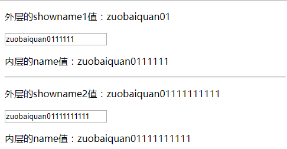

### **angualrjs中ng-if与ng-show或hide区别**

>1. ng-if在后面表达式为 true 的时候才创建这个 dom 节点，ng-show是初始时就创建了，用 display:block和 display:none 来控制显示和不显示。
>
>2. ng-if会（隐式地）产生新作用域，ng-switch、 ng-include 等会动态创建一块界面的也是如此。这样会导致，在 ng-if中用基本变量绑定 ng-model，并在外层 div 中把此 model 绑定给另一个显示区域，内层改变时，外层不会同步改变，因为此时已经是两个变量了。


```html
<body ng-app="myApp">
<div ng-controller="firstController">
    <div>========ng-if========</div>
    <p>外层的showname1值：{{showname1}}</p>
    <div ng-if="true">
        <input type="text" ng-model="showname1">
        <p>内层的name值：{{showname1}}</p>
    </div>

    <hr/>
    <div>========ng-show========</div>
    <p>外层的showname2值：{{showname2}}</p>
    <div ng-show="true">
        <input type="text" ng-model="showname2">
        <p>内层的name值：{{showname2}}</p>
    </div>
</div>
</body>
<script type="text/javascript" src="../lib/angular.js"></script>
<script type="text/javascript">
    angular.module("myApp",[]).controller("firstController", function ($scope) {
        $scope.showname1="zuobaiquan01";
        $scope.showname2="zuobaiquan01";
    });  
</script>
```



### AngularJS中的作用域

每个 Angular 应用默认有一个根作用域 $rootScope， 根作用域位于最顶层，从它往下挂着各级作用域。

通常情况下，页面中 `ng-model` 绑定的变量都是在对应的 Controller 中定义的。如果一个变量未在当前作用域中定义，JavaScript 会通过当前 Controller 的 prototype **向上查找**，也就是**作用域的继承**。

#### 基本类型变量

```html
<body ng-app="myApp">
<div ng-controller="OuterCtrl">
  <p>{{x}}</p>
  <div ng-controller="InnerCtrl">
    <input type="text" ng-model="x">
  </div>
</div>
</body>
<script type="text/javascript" src="../lib/angular.js"></script>
<script type="text/javascript">
    angular.module("myApp",[])
    .controller("OuterCtrl", function ($scope) {
        $scope.x = 'hello';
    })
    .controller("InnerCtrl", function ($scope) {
        //$scope.x = 'hello';
    });  
</script>
//运行后会发现跟文章开头一样的问题，里面输入框变了，外面的没跟着变。
//原因在于，InnerCtrl 中并未定义 x 这个变量，取值的时候，会沿着原型链向上找，
//找到了 OuterCtrl 中定义的 x ，然后赋值给自己，在 InnerCtrl 的输入框输入值时，
//改变的是 InnerCtrl 中的 x ，而对 OuterCtrl 中的 x 无影响。此时，两个 x 是独立的。
```

不过，如果你不嫌麻烦的话，用 `$scope.$parent` 可以绑定并影响上一层作用域中的基本变量：

```html
<input type="text" ng-model="$parent.x">
```

#### 引用类型变量

那么，如果上下级作用域想共用变量怎么办呢？答案是使用**引用类型变量**。

```html
<body ng-app="myApp">
<div ng-controller="OuterCtrl">
  <p>{{data.x}}</p>
  <div ng-controller="InnerCtrl">
    <input type="text" ng-model="data.x">
  </div>
</div>
</body>
<script type="text/javascript" src="../lib/angular.js"></script>
<script type="text/javascript">
    angular.module("myApp",[])
    .controller("OuterCtrl", function ($scope) {
        $scope.data = {};
        $scope.data.x = 'hello';
    })
    .controller("InnerCtrl", function ($scope) {
        //$scope.x = 'hello';
    });  
</script>
//在这种情况下，两者的 data 是同一个引用，对这个对象上面的属性修改，是可以反映到两级对象上的。
```


